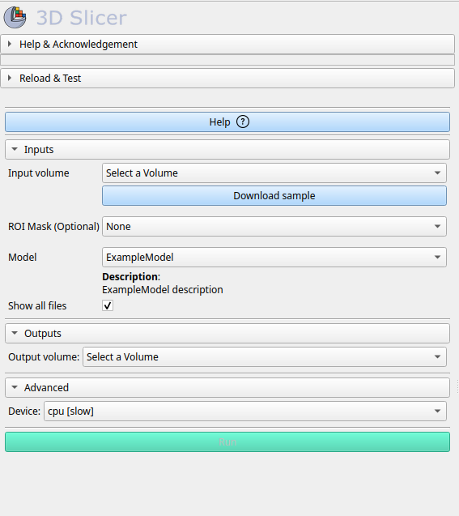

# SlicerI2IHub

## 🔌 Integrating a Custom Model into the ImageTranslator Module

To add your own AI model to the **ImageTranslator** module of the `I2IHub` Slicer extension, follow these 3 steps. The integration is designed to be modular and automatic once the proper structure is respected.

### ✅ Step 1 — Implement a New Model Class

Create a Python class in the directory:

```
.../I2IHub/ImageTranslator/ImageTranslatorLib/ModelsImpl/
```

Your class must inherit from the `BaseModel` abstract class and implement the required methods. Here is the base structure:

```python
from ImageTranslatorLib.ModelBase import BaseModel, register_model

@register_model("your_unique_model_key")
class YourModelClass(BaseModel):
    def __init__(self, modelKey: str, device: str = "cpu"):
        super().__init__(modelKey, device)

    def _loadModelFromPath(self, modelPath):
        # Load the model using your framework (e.g. torch, onnx, etc.)
        pass

    def runInference(self, inputVolume, outputVolume, inputMask=None, showAllFiles=True):
        # Define the inference procedure
        pass
```

* The `@register_model("your_unique_model_key")` decorator is **mandatory** and must match the key used in `model_metadata.json`.
* Implement `_loadModelFromPath(modelPath)` to define how your model is loaded (e.g. `torch.load`, `onnxruntime`, etc.).
* Implement `runInference(...)` to define how the model performs inference and writes results to the `outputVolume`.

You can also optionally implement `preprocess(...)` and helper methods for preprocessing input volumes, applying transforms, etc.

For a full example, see the class `FedSynthBrainLietAlModel` provided in the source tree.

---

### 🧠 Step 2 — Add Your Model Entry to the Metadata File

Open the file:

```
.../I2IHub/ImageTranslator/Resources/Models/model_metadata.json
```

Add a new entry in the following format:

```json
"your_unique_model_key": {
  "url": "https://example.com/path/to/your_model_file.onnx",
  "display_name": "Your Model Display Name",
  "description": "A detailed HTML-formatted description of your model. <b>Include citations, inputs, and outputs.</b>",
  "module_name": "YourModelClass" 
}
```

* `your_unique_model_key`: must match the string used in the `@register_model(...)` decorator and the model file name.
* `url`: direct link to download the model file (e.g., `.pth`, `.onnx`, etc.).
* `module_name`: must match the name of the class and the module.py you've defined (e.g. module: `YourModelClass.py`, class name: `YourModelClass`).
* `description`: supports HTML tags to format citations, inputs, and outputs. E.g., use `<b>`, `<cite>`, `<br/>`.

---

### 📦 Step 3 — Name and Upload Your Model File

Save your model file (e.g. `your_unique_model_key.onnx`) and host it at the `url` specified in the JSON. The model filename **must** start with the same key used in the decorator and the metadata (e.g., `your_unique_model_key.onnx` or `your_unique_model_key.zip`).

Place the model in:

```
.../I2IHub/ImageTranslator/Resources/Models/
```

> If the model is not already present locally, the system will **automatically download** it from the provided URL when selected in the GUI.

---

### 🧠 Full Example

This [class]((../I2IHub/ImageTranslator/ImageTranslatorLib/ModelsImpl/FedSynthBrainLietAlModel.py)) is a complete working example using Torch and ONNX Runtime. It demonstrates custom:

* Loading
* Preprocessing
* Inference
* Integration with the Slicer views

You can use it as a starting template.

Here is a basic example to get you started:

1. Implement a new model class

   a. Go to  `.../I2IHub/ImageTranslator/ImageTranslatorLib/ModelsImpl`

   b. Create your python module: `ExampleModel.py`

   c. Create your new custom model class: 

    ```python
    from ImageTranslatorLib.ModelBase import BaseModel, register_model
            
    @register_model("your_model_unique_key")
    class ExampleModel(BaseModel):
        def _loadModelFromPath(self, modelPath):
            # Upload the model from the OS as you prefer
            model = ...
            return model
                
        def runInference(self, inputVolume, outputVolume, inputMask=None, showAllFiles=True):
            # Customize your preprocess, run inference and show the output
            ...
    ```

2. Update Metadata File at `.../I2IHub/ImageTranslator/Resources/Models/metadata.json`
    ```json
        {
            "...": {
                "..."
            },
            "your_model_unique_key": {
                "url": "https://example.com/examplemodel.ext",
                "display_name": "ExampleModel",
                "description": "ExampleModel description",
                "module_name": "ExampleModel"
            }
        }
3. Export your model file (`your_unique_model_key.extension`) and host it at the `url` specified in the JSON. The model filename **must** start with the same key used in the decorator and the metadata (`your_unique_model_key`).

4. Reload the module and enjoy your model!

<center>
    
</center>

---

### ✅ Summary of Requirements

| Requirement       | Description                                                              |
| ----------------- | ------------------------------------------------------------------------ |
| Class location    | `ImageTranslatorLib/ModelsImpl/`                                         |
| Required methods  | `_loadModelFromPath(...)`, `runInference(...)`                           |
| Decorator         | `@register_model("your_model_key")`                                      |
| Metadata file     | Add an entry to `model_metadata.json`                                    |
| Model file naming | Must start with the same `your_model_key` used in the decorator and JSON |
| Download support  | Model is auto-downloaded if not present locally                          |

---

### 🧩 Everything Else is Automatic

Once your model class is implemented and the metadata updated:

* It will appear automatically in the dropdown menu of the module UI.
* It will be downloaded and loaded dynamically as needed.
* Your inference and preprocessing logic will run when selected.

---
