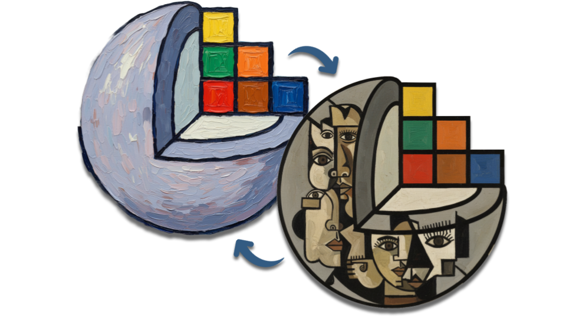

# SlicerModalityConverter
[](https://download.slicer.org/)
[](https://download.slicer.org/)
[](https://extensions.slicer.org/catalog)
[](LICENSE)


<center></center>

---

- [SlicerModalityConverter](#slicermodalityconverter)
  - [Installation](#installation)
  - [ModalityConverter](#modalityconverter)
    - [Key Features](#key-features)
    - [How to Use](#how-to-use)
    - [Available Models](#available-models)
    - [Example (with video)](#example-with-video)
    - [How to Integrate a Custom Model](#how-to-integrate-a-custom-model)
    - [Summary of Requirements](#summary-of-requirements)
  - [Tutorials](#tutorials)
    - [Skull Extraction from T1w MRI via Deep Learning-based Image-to-Image Translation in 3D Slicer](#skull-extraction-from-t1w-mri-via-deep-learning-based-image-to-image-translation-in-3d-slicer)
  - [How to Contribute](#how-to-contribute)
  - [How to Cite](#how-to-cite)

---

***SlicerModalityConverter*** is an open-source 3D Slicer extension designed for medical image-to-image (I2I) translation.

The ModalityConverter module integrates multiple deep learning models trained for different kind of I2I translation (MRI-to-CT, CBCT-to-CT, CT-to-PET), providing a user-friendly interface.

## Installation

This extension is available in the official [3D Slicer Extensions Index](https://github.com/Slicer/ExtensionsIndex/tree/main), under the **Image Synthesis** category (from version 5.9.0 onwards).  
**You can install it directly through the Extension Manager in 3D Slicer ≥ 5.9.0**, **or** [**manually**](https://extensions.slicer.org/) **for earlier versions** (< 5.9.0).  

Here is a short [video tutorial](https://youtu.be/QsxzjQb05D4?feature=shared) showing how to install extensions both via the Extension Manager and manually.

## ModalityConverter

### Key Features

- Support for multiple pre-trained deep learning models
- GPU acceleration support for faster processing
- Easy custom models integration for advanced users

### How to Use

- Select an input image
- Choose a pre-trained model from the dropdown menu. Selecting each model will display detailed information on the translation modality, specific processing and inference output
- Optionally provide a binary mask to focus the translation on specific regions
- Click "Run" to generate the synthetic image

This extension is intended for **research purposes only**. If a model is applied to an input image of the wrong type (i.e. using a CT or CBCT instead of an MRI for an MRI-to-sCT model), the output will be wrong or unpredictable.

### Available Models

| Modality | Anatomy  | Original Study | More Info |
|----------|--------|--------------------|--------------------|
| T1w-MRI → CT | Brain | Raggio et al., FedSynthCT-Brain: A federated learning framework for multi-institutional brain MRI-to-CT synthesis (Li et al. architecture) | [Read more](https://www.sciencedirect.com/science/article/pii/S0010482525005116) |
| T1w-MRI → CT | Brain | Raggio et al., FedSynthCT-Brain: A federated learning framework for multi-institutional brain MRI-to-CT synthesis (Fu et al. architecture) | [Read more](https://www.sciencedirect.com/science/article/pii/S0010482525005116) |
| T1w-MRI → CT | Brain | Raggio et al., FedSynthCT-Brain: A federated learning framework for multi-institutional brain MRI-to-CT synthesis (Spadea, Pileggi et al. architecture)| [Read more](https://www.sciencedirect.com/science/article/pii/S0010482525005116) |
| CBCT → CT | Head & Neck | Raggio et al., A Privacy-Preserving Federated Learning Framework for Generalizable CBCT to Synthetic CT Translation in Head and Neck | [Read more](https://arxiv.org/abs/2506.08654v1) |
| CT → PET | Chest/Lung | Salehjahromi, Karpinets et al., Synthetic PET from CT improves diagnosis and prognosis for lung cancer: Proof of concept | [Read more](https://www.sciencedirect.com/science/article/pii/S2666379124001071) |


### Example (with video)

1. Click **Download sample** to open the *Sample Data* module.  
2. Download the **MRHead** volume.  
3. In the *ModalityConverter* module, select the MRHead volume as **Input volume**.  
4. From the **Model** list, choose the desired model (e.g., `[Brain] FedSynthCT MRI-T1w Li Model`).  
5. (Optional) Check **Preview volumes** if you want to visualize intermediate volumes generated during processing.  
6. Choose the **Output volume**.  
7. In the **Advanced** section, select the device from the **Device** list. A GPU device provides faster inference.  

At this point, the interface should look like this:  
<center>

</center>

8. Click **Run** to start the inference. The resulting volume will appear once the process is complete:  
<center>

</center>

**Full example**


https://github.com/user-attachments/assets/c4a71794-36d1-40d6-91c9-47f56983d56c


### How to Integrate a Custom Model

To add your own model to the **ModalityConverter** module of the ModalityConverter Slicer extension, follow these 3 steps. The integration is designed to be modular and automatic once the proper structure is respected.

🧠 **Step 1 — Implement a New Model Class**

Create a Python class in the directory:

```
.../ModalityConverter/ModalityConverter/ModalityConverterLib/ModelsImpl/
```

Your class must inherit from the `BaseModel` abstract class and implement the required methods. Here is the base structure:

```python
from ModalityConverterLib.ModelBase import BaseModel, register_model

@register_model("your_unique_model_key")
class YourModelClass(BaseModel):
    def __init__(self, modelKey: str, device: str = "cpu"):
        super().__init__(modelKey, device)

    def _loadModelFromPath(self, modelPath):
        # Load the model using your framework (e.g. torch, onnx, etc.)
        pass

    def runInference(self, inputVolume, outputVolume, inputMask=None, showAllFiles=True):
        # Define the inference procedure
        pass
```

- The `@register_model("your_unique_model_key")` decorator is **mandatory** and must match the key used in `model_metadata.json`.
- Implement `_loadModelFromPath(modelPath)` to define how your model is loaded (e.g. `torch.load`, `onnxruntime`, etc.).
- Implement `runInference(...)` to define how the model performs inference and writes results to the `outputVolume`.

You can also optionally implement `preprocess(...)` and helper methods for preprocessing input volumes, applying transforms, etc.

For a full example, see the classes `FedSynthBrainBaseModel` and `FedSynthBrainLiModel` provided in the source tree.

---

🏷️ **Step 2 — Add Your Model Entry to the Metadata File**

Open the file:

```
.../ModalityConverter/ModalityConverter/Resources/Models/model_metadata.json
```

Add a new entry in the following format:

```json
"your_unique_model_key": {
  "url": "https://example.com/path/to/your_model_file.onnx",
  "display_name": "Your Model Display Name",
  "description": "A detailed HTML-formatted description of your model. <b>Include citations, inputs, and outputs.</b>",
  "module_name": "YourModelClass" 
}
```

- `your_unique_model_key`: must match the string used in the `@register_model(...)` decorator and the model file name.
- `url`: direct link to download the model file (e.g., `.pth`, `.onnx`, etc.).
- `module_name`: must match the name of the class and the module.py you've defined (e.g. module: `YourModelClass.py`, class name: `YourModelClass`).
- `description`: supports HTML tags to format citations, inputs, and outputs. E.g., use `<b>`, `<cite>`, `<br/>`. The following template can be used:

```html
[MODEL_DESCRIPTION]<br><b>Input</b>: [MODALITY]<br><b>Preprocess</b>: [PRE_PROCESSING_DESCRIPTION]<br><b>Output</b>: [SYNTHETIC_OUTPUT_MODALITY] [OUTPUT_DIMENSION].<br><b>How to cite:</b><br>If you use this model, please cite:<br><cite>[CITATION]</cite>
```

---

📦 **Step 3 — Name and Upload Your Model File**

Save your model file (e.g. `your_unique_model_key.onnx`) and host it at the `url` specified in the JSON. The model filename **must** start with the same key used in the decorator and the metadata (e.g., `your_unique_model_key.onnx` or `your_unique_model_key.zip`).

Place the model in:

```
.../ModalityConverter/ModalityConverter/Resources/Models/
```

> If the model is not already present locally, the system will **automatically download** it from the provided URL when selected in the GUI.

---

**Full Example**

Here is a basic example to get started:

1. Implement a new model class

   a. Go to  `.../ModalityConverter/ModalityConverter/ModalityConverterLib/ModelsImpl`

   b. Create a python module: `ExampleModel.py`

   c. Create a new custom model class:

    ```python
    from ModalityConverterLib.ModelBase import BaseModel, register_model
            
    @register_model("a_model_unique_key")
    class ExampleModel(BaseModel):
        def _loadModelFromPath(self, modelPath):
            # Upload the model from the OS as you prefer
            model = ...
            return model
                
        def runInference(self, inputVolume, outputVolume, inputMask=None, showAllFiles=True):
            # Customize your preprocess, run inference and show the output
            ...
    ```

2. Update Metadata File at `.../ModalityConverter/ModalityConverter/Resources/Models/metadata.json`

    ```json
        {
            "...": {
                "..."
            },
            "a_model_unique_key": {
                "url": "https://example.com/examplemodel.ext",
                "display_name": "ExampleModel",
                "description": "ExampleModel description",
                "module_name": "ExampleModel"
            }
        }
3. Export the pretrained model file (`a_model_unique_key.extension`) and host it at the `url` specified in the JSON. The model filename **must** start with the same key used in the decorator and the metadata (`a_model_unique_key`).

4. Reload the module and enjoy your model! Once your model class is implemented and the metadata updated:

- It will appear automatically in the dropdown menu of the module UI.
- It will be downloaded and loaded dynamically as needed.
- Your inference and preprocessing logic will run when selected.

<center>
    
</center>

---

### Summary of Requirements

| Requirement         | Description                                                                      |
| ------------------- | -------------------------------------------------------------------------------- |
| Class location      | `ModalityConverterLib/ModelsImpl/`                                                 |
| Required methods    | `_loadModelFromPath(...)`, `runInference(...)`                                   |
| Model key decorator | `@register_model("your_model_key")`                                              |
| Metadata file       | Add an entry to `model_metadata.json`                                            |
| Model file naming   | Must start with the same `your_model_key` used in the decorator and JSON         |
| Download support    | Model file is auto-downloaded from the provided URL if it is not present locally |

---

## Tutorials

### [Skull Extraction from T1w MRI via Deep Learning-based Image-to-Image Translation in 3D Slicer](https://github.com/ciroraggio/SlicerModalityConverter/blob/develop/ModalityConverter/assets/tutorials/MRItoCT-skull.mp4)


## How to Contribute

Integrating new models for different modalities is encouraged!

Once you have integrated and tested your custom model locally, simply create a pull request in the [original repository](https://github.com/ciroraggio/SlicerModalityConverter/) to request integration of your model into the 3D Slicer extension.

If you require any further information or have any queries, please send an email to: <email>ciro.raggio@kit.edu</email>.

## How to Cite

Please cite the relevant publication when using models integrated in this module. Each model's description includes its corresponding citation information.

The ModalityConverter 3D Slicer module should be cited as follows:

<cite>
Raggio C.B., Zaffino P., Spadea M.F., SlicerModalityConverter: An Open-Source 3D Slicer Extension for Medical Image-to-Image Translation, 2025, https://github.com/ciroraggio/SlicerModalityConverter .
</cite>
